# DevTalks

#### DevTalks is an application made in Django backed by RDBMS. This Application falls under the category of Forum
#### As a developer, you might be having many doubts, or having some cool tricks to show to the world
#### If it is, this platform is for you

#### Here People can create the account, look into the daily feed, customize their feeds based on tag-based filtering
#### You can also create a new question or revert to another questionair in form of answer
#### You can like the question and can upvote the answer
#### After asking some questions and responding to some question, you will be given Badge, which will be displayed over your profile.

## Signup Page
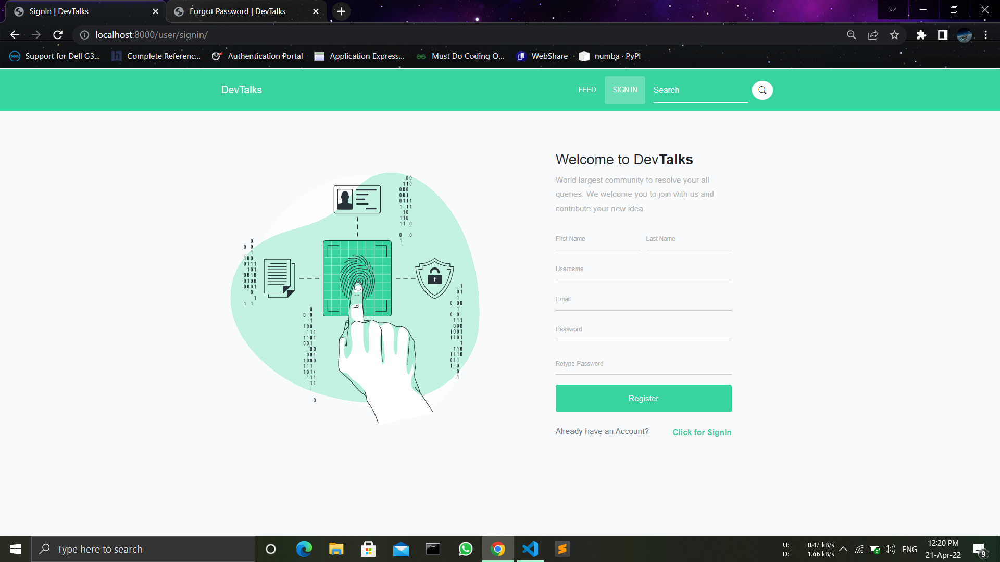

## Mail Notification over signup
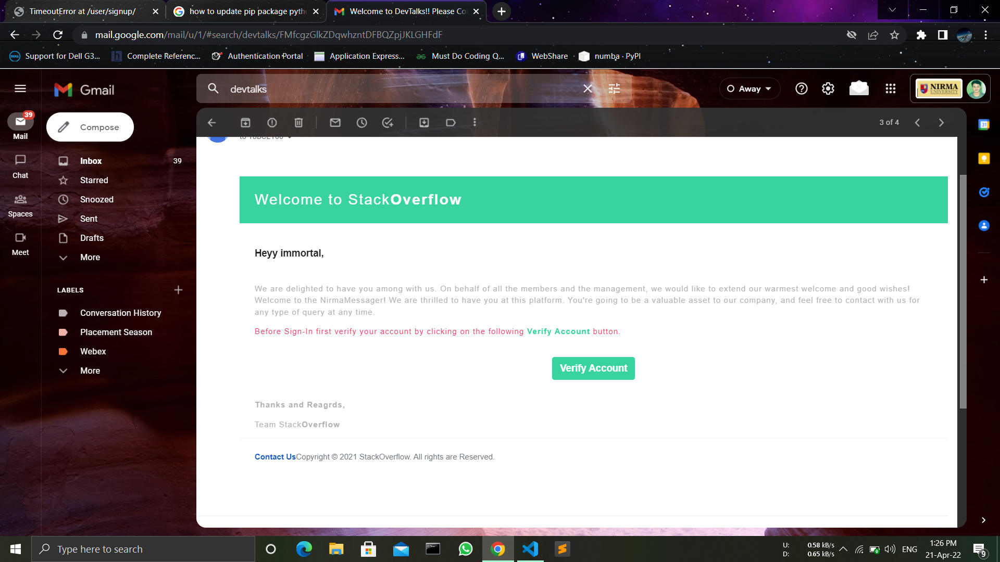

## Signin Page
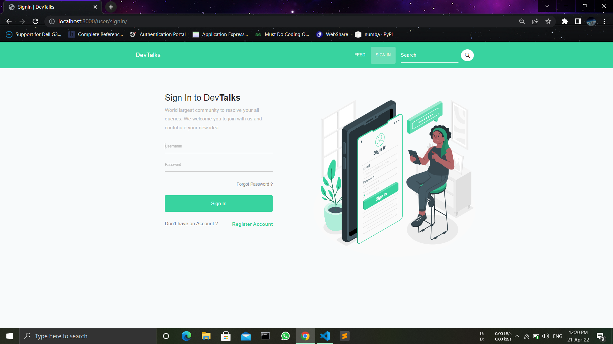

## Forgot Password
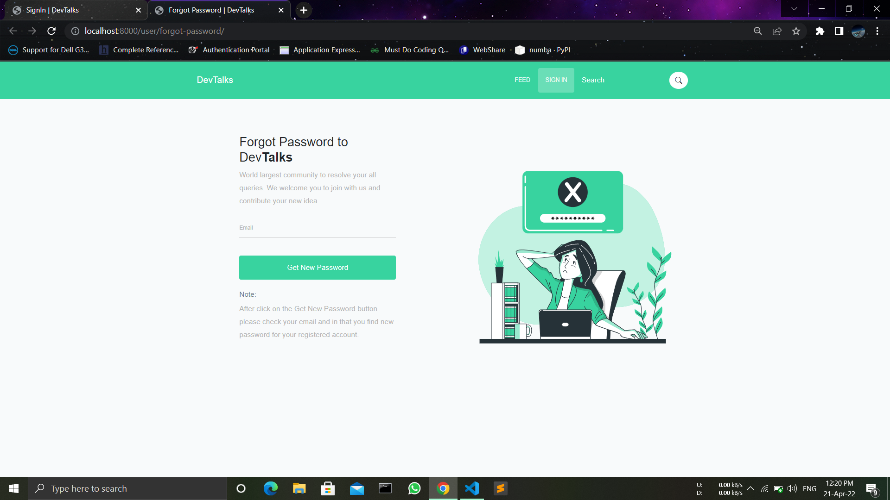

## Profile Page
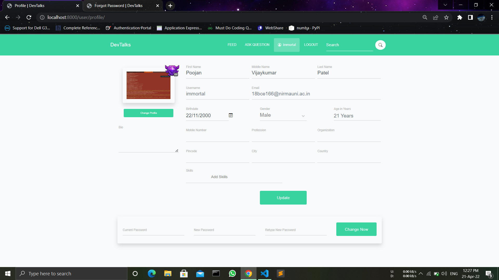

## Home Page
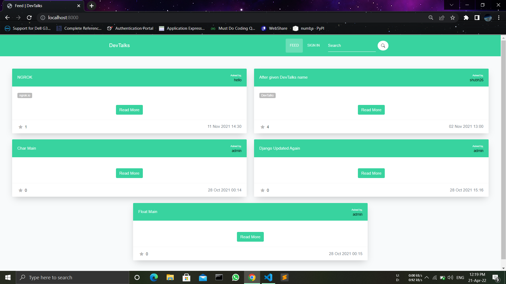

## Filtering
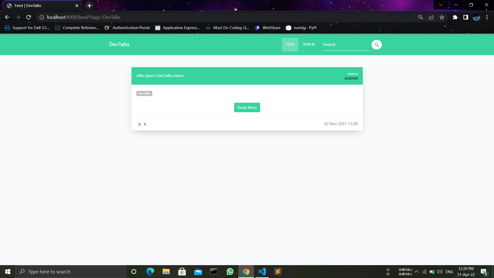

## Question Asking
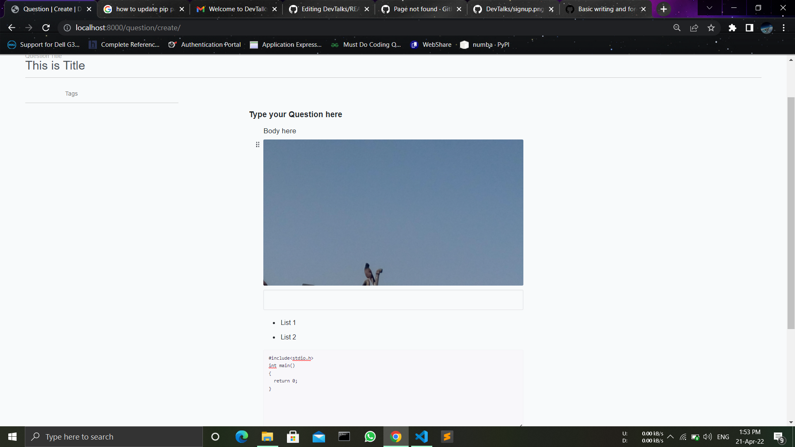

## Answer Giving
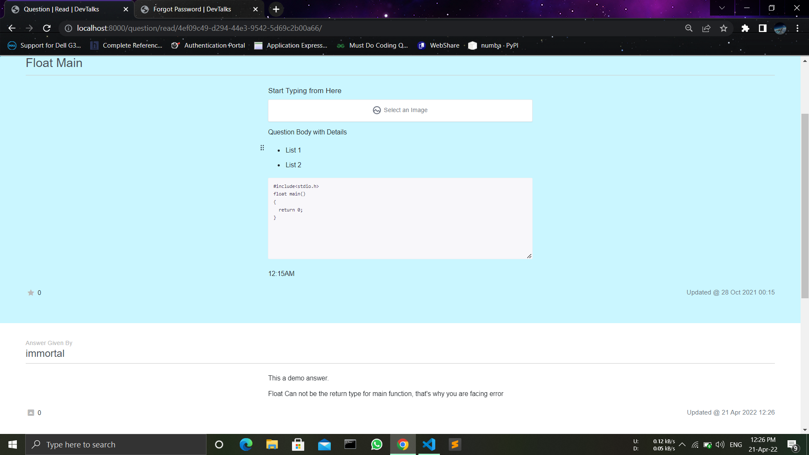

## Question Like
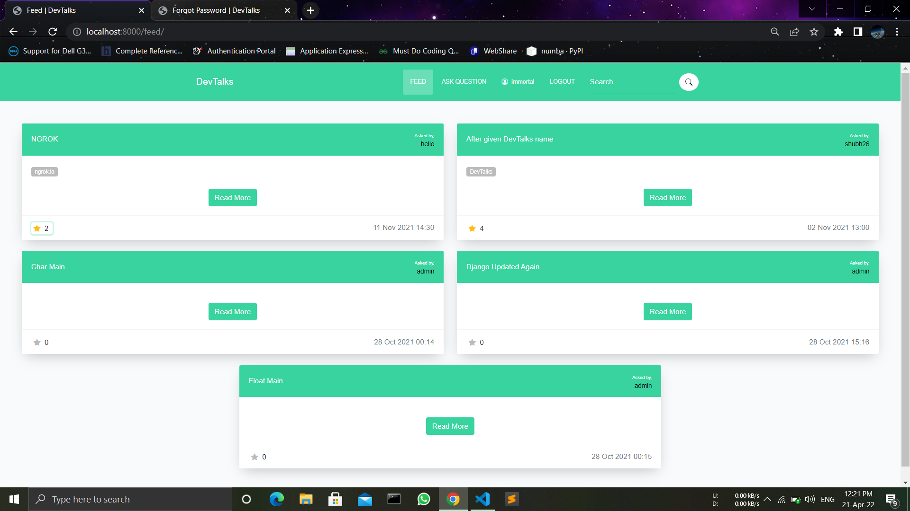

## Answer Upvote
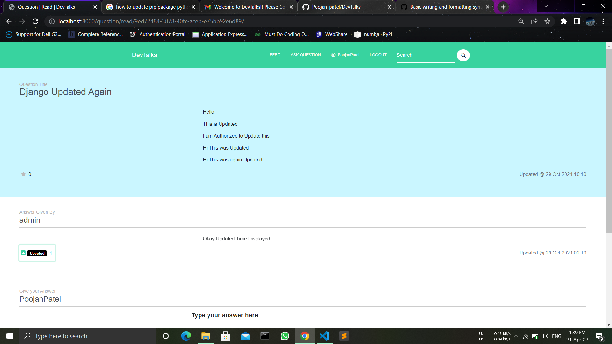

